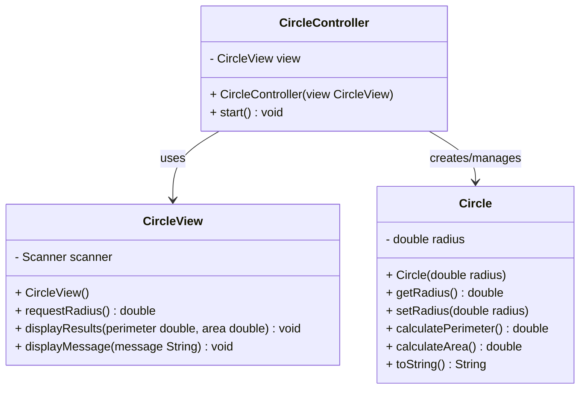

# CircleMVC — Java Back-End Project Built with Maven

## 📘 Project Description
This is a **Java Back-End** project built with **Maven**, following the **Model-View-Controller (MVC)** design pattern.  
The goal of the project is to create a simple `Circle` class that can calculate and store geometric data (area and perimeter) based on a given radius.

Later, the project will include a **SQL database** to store all circle data entered via the keyboard.  
Each entry will record:
- The radius
- The calculated perimeter
- The calculated area

---

## 🧮 1. Features
- Input a circle’s radius.
- Compute the **area** and **perimeter**.
- Display results through the console view.
- Future feature: Store results in a **SQL database**.

---

## 🏗️ 2. Architecture. Explanation of the MVC Pattern
The project follows the **MVC (Model-View-Controller)** pattern:

- **Model:** Represents the data and business logic (e.g., the `Circle` class).
- **View:** Handles user interaction (e.g., console input/output).
- **Controller:** Coordinates communication between the Model and the View.

```
┌────────────┐       ┌─────────────┐       ┌────────────┐
│   View     │ <---> │ Controller  │ <---> │   Model    │
└────────────┘       └─────────────┘       └────────────┘
```

| Layer | Role | Class |
|-------|------|-------|
| **Model** | Represents the data and business logic | `Circle.java` |
| **View** | Handles user interaction (input/output) | `CircleView.java` |
| **Controller** | Coordinates interaction between model and view | `CircleController.java` |

---
---

## 📦 3. Project Structure
```
java-mvc-circle/
├── src/
│   ├── main/
│   │   ├── java/
│   │   │   └── com/example/circle/
│   │   │       ├── model/
│   │   │       │   └── Circle.java
│   │   │       ├── view/
│   │   │       │   └── CircleView.java
│   │   │       └── controller/
│   │   │           └── CircleController.java
│   │   └── resources/
│   └── test/
│       └── java/
│           └── com/example/circle/
│               └── CircleTest.java
├── pom.xml
└── README.md
```

## 📊 4. UML Diagram
> *(To be added once the classes are created)*

The UML diagram will include:
- `Circle` class with its attributes (`radius`) and methods (`getArea()`, `getPerimeter()`).
- MVC relationships between the **Model**, **View**, and **Controller**.

---

## 🧭 4.1. UML Diagram in Mermaid Format



## 🧭 4.2. Full UML Diagram (Model-View-Controller)

```
┌────────────────────────────┐
│        Circle              │  <<Model>>
├────────────────────────────┤
│ - radius: double           │
├────────────────────────────┤
│ + Circle(radius: double)   │
│ + getRadius(): double      │
│ + setRadius(radius: double)│
│ + calculatePerimeter(): double │
│ + calculateArea(): double  │
│ + toString(): String       │
└────────────────────────────┘

             ▲
             │ uses
             │
┌────────────────────────────┐
│       CircleController     │  <<Controller>>
├────────────────────────────┤
│ - view: CircleView         │
├────────────────────────────┤
│ + CircleController(v: CircleView) │
│ + start(): void            │
└────────────────────────────┘
             │
             │ calls
             ▼
┌────────────────────────────┐
│        CircleView          │  <<View>>
├────────────────────────────┤
│ - scanner: Scanner         │
├────────────────────────────┤
│ + CircleView()             │
│ + requestRadius(): double  │
│ + displayResults(p: double, a: double): void │
│ + displayMessage(msg: String): void          │
└────────────────────────────┘
```

---

## 💻 5. Base Code for Each Class

### 🧱 Model: `Circle.java`
```java
package com.teoria.circulo.model;

public class Circle {
    private double radius;

    public Circle(double radius) {
        this.radius = radius;
    }

    public double getRadius() {
        return radius;
    }

    public void setRadius(double radius) {
        this.radius = radius;
    }

    public double calculatePerimeter() {
        return 2 * Math.PI * radius;
    }

    public double calculateArea() {
        return Math.PI * Math.pow(radius, 2);
    }

    @Override
    public String toString() {
        return "Circle [radius=" + radius + 
               ", perimeter=" + calculatePerimeter() + 
               ", area=" + calculateArea() + "]";
    }
}
```

### 🎨 View: `CircleView.java`
```java
package com.teoria.circulo.view;

import java.util.Scanner;

public class CircleView {
    private Scanner scanner;

    public CircleView() {
        scanner = new Scanner(System.in);
    }

    public double requestRadius() {
        System.out.print("Enter the circle's radius: ");
        return scanner.nextDouble();
    }

    public void displayResults(double perimeter, double area) {
        System.out.printf("Perimeter: %.2f%n", perimeter);
        System.out.printf("Area: %.2f%n", area);
    }

    public void displayMessage(String message) {
        System.out.println(message);
    }
}
```

### 🧭 Controller: `CircleController.java`
```java
package com.teoria.circulo.controller;

import com.teoria.circulo.model.Circle;
import com.teoria.circulo.view.CircleView;

public class CircleController {
    private CircleView view;

    public CircleController(CircleView view) {
        this.view = view;
    }

    public void start() {
        double radius = view.requestRadius();
        Circle circle = new Circle(radius);

        double perimeter = circle.calculatePerimeter();
        double area = circle.calculateArea();

        view.displayResults(perimeter, area);

        // Later: save to database
        // saveToDB(circle);
    }
}
```

### 🚀 Main Class
```java
package com.teoria.circulo;

import com.teoria.circulo.view.CircleView;
import com.teoria.circulo.controller.CircleController;

public class Main {
    public static void main(String[] args) {
        CircleView view = new CircleView();
        CircleController controller = new CircleController(view);
        controller.start();
    }
}
```

---

## 🧩 6. Future Expansion: SQL Database Connection

Later, the project will add:

- A `CircleDAO` class (in `model.dao`) to handle CRUD operations with SQL.
- A `circles` table in the database with columns:

```sql
CREATE TABLE circles (
    id INT AUTO_INCREMENT PRIMARY KEY,
    radius DOUBLE,
    perimeter DOUBLE,
    area DOUBLE
);
```

- The controller will call `CircleDAO.insert(circle)` after calculating results.

---

## ⚙️ 7. Requirements
- Java 17 or later
- Maven 3.8+
- (Optional later) MySQL or PostgreSQL for data persistence

---

## 🚀 8. How to Run the Project
1. **Clone this repository:**
   ```bash
   git clone https://github.com/yourusername/java-mvc-circle.git
   cd java-mvc-circle
   ```

2. **Build the project with Maven:**
   ```bash
   mvn clean install
   ```

3. **Run the application:**
   ```bash
   mvn exec:java -Dexec.mainClass="com.example.circle.Main"
   ```

---

## 🧠 9. Future Improvements
- [ ] Add SQL database integration to store circle data.
- [ ] Add unit tests with JUnit.
- [ ] Add a graphical user interface (optional).
- [ ] Generate and include the UML diagram.

---

## 📄 10. License
This project is open-source and available under the [MIT License](LICENSE).

---

## ✍️ 11. Author
**AlexP**  
GitHub: [@alexpjava](https://github.com/alexpjava)  
Email: alexp.java@gmail.com
